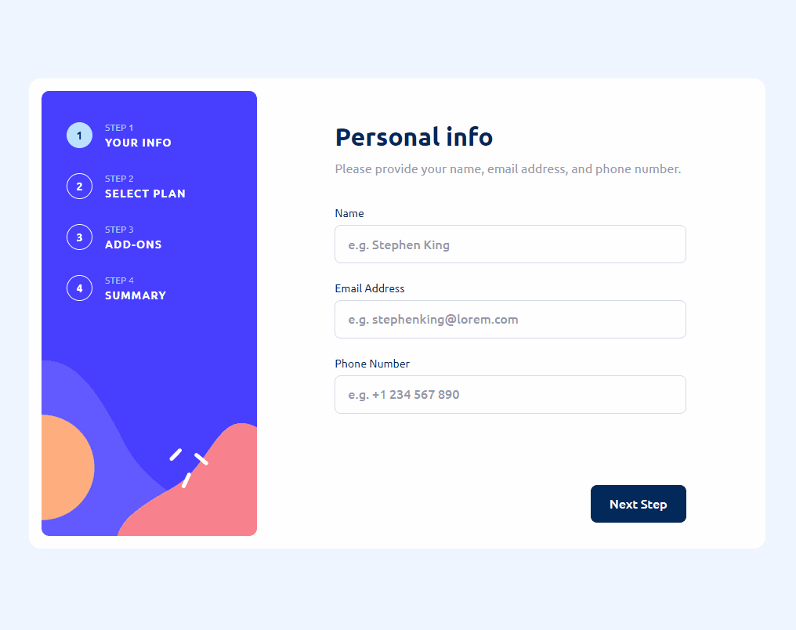

# Multi Step React Component

<div align="center"></div>

Design, assets, and requirements provided thanks to [FrontEnd Mentor](https://www.frontendmentor.io/challenges/multistep-form-YVAnSdqQBJ).

The project requirement was to create a functional multi-step form that allows users to input the following information:

1. Name, email address, phone number
2. Choice of yearly or monthly subscription plan
3. Extra services to add-on.

At the end of the form, user's can review their information, see their total, and submit the form. Once the submission is complete, the user has the option to start over and reset the form. Resetting the form was not a requirement, but I felt would be a nice feature to have for the sake of this "challenge" environment.

## Techstack

This project was bootstrapped with [Vite](https://vitejs.dev/guide/) using the the React/Typescript template. The project is linted with [ESLint](https://eslint.org/docs/latest/user-guide/getting-started) using latest react, prettier, cypress, [jsx-a11y](https://github.com/jsx-eslint/eslint-plugin-jsx-a11y) rules for syntax integrity.

Some of the tools and libraries used in this project include:

- [React](https://reactjs.org/), a JavaScript library for building user interfaces.
- [Typescript](https://www.typescriptlang.org/), a typed superset of JavaScript that compiles to plain JavaScript.
- [Cypress](https://www.cypress.io/), a JavaScript end-to-end testing framework.
- [Styled Components](https://styled-components.com/), a CSS-in-JS library that allows for writing CSS in JavaScript.
- [Redux Toolkit](https://redux-toolkit.js.org/), a package that helps simplify Redux development.
- [React-hook-form](https://react-hook-form.com/), a library to handle form state management and validation.

A continous integration and deployment pipeline was created using [GitHub Actions](https://github.com/features/actions). The `.yml` files can be found in the `.github/workflows` directory.

## Installation and Usage

To run the application locally, please follow the steps below:

1. Ensure that [Git](https://git-scm.com/) is installed on your machine and in the target directory run the `git clone https://github.com/JorgeAMendoza/multi-step-form` command.
2. Navigate to the project directory with `cd multi-step-form` and run the `npm install` command to install the project dependencies.
3. Run the `npm run dev` command to start the development server. The application will be running on `localhost:3000`.

To run the application in the production environment, run `npm run build` to build the application and then run `npm run preview` to preview the application on `localhost:3000`.

With the Cypress testing library, you can either run `npm run cypress:run` to have the test runner run in the CLI, or run `npm run cypress:open` to view the tests in the Cypress GUI. For both cases, ensure that _the application is running_ before running the tests.

## Development

This section covers the development processs of the application, along with the decisions made and challenges that were faced.

### Deciding on a Techstack

One of the reasons I chose this challenge was because I wanted to get more familiar with some of the packages I know and use them together. When looking at the requirement specifications and `.fig` file, I observed the following:

1. Data should persist between pages, meaning user's can switch back and forth between pages and see the data they had previously inputted.
2. Every form should be easily validated.

My first thought was was just to pass some state around using React's Context API, but I figured that it would unnecessarily render parts of the application when it didn't need to be. This led me to choose _Redux_ with the _Redux ToolKit_ to create a store that would hold the current/saved values of the form, so when user's switch back and forth between pages their data can persist from that store.

To handle form state and validation, the _react-hook-form_ library was used, which allowed me to pass custom validations to each input and create seperate components for each input with `useController`. I initally believed that using both _Redux_ and _react-hook-form_ would cause issues, but during development it became clear that both packages handle very specific parts of the application that all that is needed to get it working is the right method calls.

### Redux

I initally wanted to create a type that could be used by both the store and the form, but since both are updated differently, but it became an issue. 

In `redux.ts` exists the following types:

```typescript
export type GamingPlans = 'arcade' | 'advanced' | 'pro'
export type FormStep = 'personalInfo' | 'plan' | 'addOns' | 'confirmation'
export type AddOns = 'onlineService' | 'largerStorage' | 'customProfile'

export interface FormStore {
  step: FormStep
  name: string
  email: string
  phoneNumber: string
  plan: GamingPlans
  subscription: 'monthly' | 'yearly'
  addOns: { [Key in AddOns]: boolean }
}

export interface Prices {
  plans: { [Key in GamingPlans]: { monthly: number; yearly: number } }
  addOns: { [Key in AddOns]: { monthly: number; yearly: number } }
}
```

In `reducer.ts`, both these types are used to set the initial state of the reducer along with its overall type.

```typescript
const servicePrices: Prices = {
  plans: {
    arcade: { monthly: 9, yearly: 90 },
    advanced: { monthly: 12, yearly: 120 },
    pro: { monthly: 15, yearly: 150 },
  },
  addOns: {
    onlineService: { monthly: 1, yearly: 10 },
    largerStorage: { monthly: 2, yearly: 20 },
    customProfile: { monthly: 2, yearly: 20 },
  },
}

const initalState: FormStore & { prices: Prices } = {
  name: '',
  email: '',
  phoneNumber: '',
  plan: 'arcade',
  subscription: 'monthly',
  addOns: {
    onlineService: false,
    largerStorage: false,
    customProfile: false,
  },
  step: 'personalInfo',
  prices: servicePrices,
}
```

I created the prices within the same folder themselves to at least simlute the price information coming down from an API. The inital state of the slice has its type defined as the [intersection type](https://www.typescriptlang.org/docs/handbook/unions-and-intersections.html#intersection-types) of `FormState` and an object with a property of `objects` that is set to the type of `Prices`.

The redux slice `formSlice` contains various reducers that are used to update the redux store when a user either changes the form data and either moves back and forth between pages, see an example of these reducers below:

```typescript
updateName: (state, action: PayloadAction<string>) => {
    state.name = action.payload
    return state
},
updateEmail: (state, action: PayloadAction<string>) => {
    state.email = action.payload
    return state
},
```

`updateName` tkaes in a string, and when fired will overwrit the `name` property of the store to the one passed in. The same concept is applied to `updateEmail` and other reducers.

The store is initalized within the `store.ts` file, where a `createStore` function is used to create an instance of the store for testing purposes, and `store` is initalized for actual application use. The file also contains the `RootState` and `AppDispatch` types for the custom hooks that are created.

#### Helper functions

Instead of firing these reducers directly in the components, helper functions were created that fire the dispatch functions themselves, but allow us to insert some extra logic for more efficient state handling. Each of these functions are meant to be used when a user navigates between form steps.
From the `updateAddOns` function below:

```typescript
export const updateAddOns = (services: {
  onlineService: boolean
  largerStorage: boolean
  customProfile: boolean
}) => {
  return (dispatch: AppDispatch) => {
    dispatch(
      formSlice.actions.updateAddOns({
        addOn: 'onlineService',
        selected: services.onlineService,
      })
    )
    dispatch(
      formSlice.actions.updateAddOns({
        addOn: 'largerStorage',
        selected: services.largerStorage,
      })
    )
    dispatch(
      formSlice.actions.updateAddOns({
        addOn: 'customProfile',
        selected: services.customProfile,
      })
    )
  }
}
```

The function above takes in a set of add-on services, a dispatch function is fired for each one with the reducer that accompanies it. If the boolean differs from the one in the store, then the store is updated, else it stays the same. I found this implementation to be easier to undertsand and maintain rather than creating a reducer and helper function for each add-on service.

#### Use Within Form Sections

Each form section will contain the `useAppDispatch` and `useAppSelector` custom hooks that are used to grab the dispatch function along with the current store, both are safely typed with TypeScript and be found in `hooks.ts`

In the `PlanSection` component, the dispatch is extracted along with the store, but only the properties for this section will be destructured from the store, see the excerpt below:

```typescript
const dispatch = useAppDispatch()
const { plan, subscription } = useAppSelector((state) => state.form)
```

When a user comes back to the page, the values from the Redux store will be used to set the current form values so the user can see the previuos data they had typed. More later on `reset`, but for see the `useEffect` below:

```typescript
useEffect(() => {
  if (!plan && !subscription) return
  reset({
    plan,
    subscription,
  })
}, [plan, subscription, reset])
```

If neither `plan` or `subscription` are set, then we can assume that the user has not modified the page yet and therefore can leave it as is, but if they are set, then use the `reset` function with the store values to have our form view match what is currently in the store.

For the form sections, there are _next_ and _previous_ buttons that allow users to navigate between the different form sections. For each click handler of these, a dispatch function should be fired that saves the current form values into the store. The only sections that differ in behavior are the personal and confimraiton pages, since one verifies the user input and the other submits the form. In the case of `PlanSection.tsx`:

```typescript
<ButtonFormContainerTwo>
  <PreviousButton
    type="button"
    onClick={() => {
      dispatch(updatePlan(getValues('plan'), getValues('subscription')))
      dispatch(updateStep('personalInfo'))
    }}
    data-testid="previousButton"
  >
    Go Back
  </PreviousButton>
  <NextButton
    type="button"
    data-testid="nextButton"
    onClick={() => {
      handleSubmit(onSubmit)()
    }}
  >
    Next Step
  </NextButton>
</ButtonFormContainerTwo>
```

`<PreviousButton>` grabs the current values and fires the helper function to save them to the store, and also calls the dispatch helper to set the current step to the previous one. `<NextButton>` calls `onSubmit` and saves the plan data and moves the step property to the next value.

### React Hook Form

Originally I was going to create one form component and let the `useForm` hook handle the form state and validation for all form sections of this project. After conducting some research and diagraming story, I found the following issues:

1. Each change in the form could cause an uncessary re-render of the form.
2. Form sections would have access to pieces of form state that would be irrelevant to them.
3. The form would be harder to maintain and test.

Reading the _react-hook-form_ documentation and reviewing examples made me realize that I was viewing my implementations the wrong way. Instead of one giant component for all form data, I could implement `useForm` in each form section so they are contained in their own component. Now vadliation can be uniquely applied to each hook, the necessary methods can be extracted, and for each instance of the hook we can create the type that is only needed for it.

#### Form Types

In `form.ts`, the following type can be found:

```typescript
import { AddOns, GamingPlans } from './redux.ts'

interface HookForm {
  name: string
  email: string
  phoneNumber: string
  plan: GamingPlans
  subscription: 'monthly' | 'yearly'
}

export type MultiStepForm = HookForm & { [Key in AddOns]: boolean }
```

The type above can be used to represent the entire form, however, each form section will only contain the portion that is needed for the component.

In the form section compoennt `PersonalSection.tsx`, the following type is created:

```typescript
export type PersonalInfoForm = Pick<
  MultiStepForm,
  'name' | 'email' | 'phoneNumber'
>
```

The component will now only have the form information/inputs it needs, not having to worry about other aspects of the form. All other components will have thier own type that is extracted like show above, using the TypeScript (`Pick`)[https://www.typescriptlang.org/docs/handbook/utility-types.html#picktype-keys] utility type.

#### useForm and useController

Each form section uses the `useForm` hook to handle the form state and validation. See the code block below from the `PersonalSection.tsx` component:

```typescript
const { control, handleSubmit, reset } = useForm<PersonalInfoForm>({
  defaultValues: {
    name: '',
    email: '',
    phoneNumber: '',
  },
  mode: 'onChange',
})
```

For each component mount, the default values are set to an empty string in this, however, as discussed in the [Redux](#use-within-form-sections) section, a useEffect checks to see if the store contains values that it needs to be set to. These values are set with the `reset` function in each Use Effect.

Instead of using `register` for reach input, the `control` property is extracted so that custom input components can be created and controlled with the [`useController`](https://react-hook-form.com/docs/usecontroller) API provded by _react-hook-form_.

The `TextInput.tsx` component demonstrates the API in use:

```typescript
const TextInput = (props: TextInputProps) => {
  const { field, fieldState } = useController(props)

  return (
    <div data-testid={`${props.name}Input`}>
      <InputName>
        <label htmlFor={`${props.name}Input`}>{props.labelText}</label>
        {fieldState.isTouched && fieldState.invalid ? (
          <span>
            {fieldState.error?.message
              ? fieldState.error.message
              : 'Invalid input'}
          </span>
        ) : null}
      </InputName>
      <InputContainer isInvalid={fieldState.error !== undefined}>
        <input
          {...field}
          type={props.type}
          placeholder={props.placeholder ? props.placeholder : ''}
          id={`${props.name}Input}`}
        />
      </InputContainer>
    </div>
  )
}
```

The hoook returns the `field` and `fieldstate` properties which can be applied to the `input` element to apply handlers, validatino, and other props. Other props plus the field values were passed including label text and a specific type (for accessbility reasons). The `fieldstate` is mainly used to indicate if the current input is valid or not, and if not then render a message to the user.

Every form section will contain a similar implementation of `useForm` and `useController`, each with their own differences.

### Styling

The application is styled using _styled-components_, personally I would love to just stay with regular CSS, but since some CSS features such as [:has](https://caniuse.com/?search=%3Ahas) is not supported in all browsers (mainly Firefox), I found that creating the conditional styles would be best done with Styled components.

An example of this would be in the `AddOnInput.styled.tsx`

```typescript
interface AddOnInputStyledProps {
  checked: boolean
}

export const AddOnInputStyled = styled.label<AddOnInputStyledProps>`
  min-height: 6.2rem;
  display: grid;
  grid-template-columns: auto 1fr auto;
  grid-template-areas:
    'check name price'
    'check desc price';
  border: ${({ checked }) =>
    checked ? '1px solid var(--purple)' : '1px solid var(--light-grey)'};
  background-color: ${({ checked }) =>
    checked ? 'var(--very-light-grey)' : 'var(--white)'};
  border-radius: 8px;
  padding: 0em 1em;
  cursor: pointer;
  position: relative;
  ...
`
```

An interface is set for the styled component, and if `checked` is true, then the border and background color will change to indicate the item has been selected. 

## Conclusion
This project was a great way to get more practice with _Redux_ and _react-hook-form_ and how they can be used together. One thing I would like to focus on the future is using a component library such as [Material UI]() to get the project off the ground much faster. If you suggestions or fixes, please feel free to open an issue or pull request. Thanks for reading!

